# 📊 Uber Ride Booking Analytics

> **Project Status: Completed**


---

## 📈 Project Overview

- This project analyzes Uber ride booking data from Delhi-NCR for 2024 to understand booking patterns, customer behavior, vehicle performance,       revenue, cancellations, incomplete rides, and location-based demand.

- The project follows a complete data analytics workflow:

  - **Raw Data → PostgreSQL → Data Cleaning → Normalization → SQL Analysis → Power BI Dashboard**

- The goal is to turn raw ride-booking data into clear business insights through SQL analysis and an interactive Power BI dashboard.


---

## 📈 View Project

### 🔹 Power BI Dashboard

- Explore the complete **5-page interactive Power BI report** covering:
  - **Overview** (booking performance)
  - **Customer Behavior Analysis**
  - **Vehicle & Service Performance**
  - **Location & Route Analysis**
  - **Cancellation & Incomplete Rides Analysis**.

- **Power BI Dashboard Link:** [uber-ride-booking-analytics-dashboard](https://github.com/Chauhanekta21/Uber_Ride_Booking_Analytics/tree/main/PowerBI_Dashboard)

- **Dashboard Preview:**
  - The Overview page is shown below. Screenshots of the remaining four pages are available in the **Power BI Dashboard**                              section.

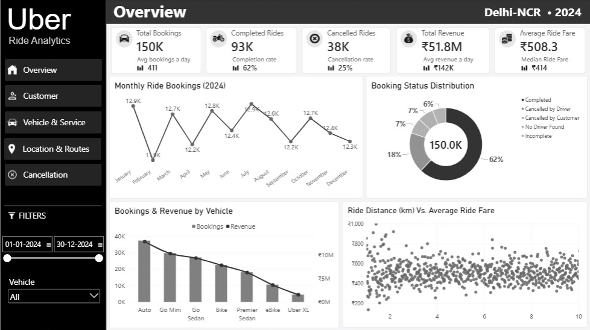

---

## 📈 Objectives

- Analyze overall booking and ride performance.
- Understand customer booking behavior and repeat usage.
- Compare vehicle performance and ride outcomes.
- Analyze revenue and ride-fare patterns.
- Identify major customer and driver cancellation reasons.
- Analyze incomplete rides and their reasons.
- Identify high-demand pickup and drop locations.
- Analyze popular routes.
- Understand payment method preferences.
- Evaluate operational metrics such as VTAT and CTAT.
- Present the findings through an interactive Power BI dashboard.

---

## 📈 Tech Stack

| Tool | Purpose |
|---|---|
| **PostgreSQL** | Database storage, cleaning, normalization and analysis |
| **SQL** | Data inspection and business analysis |
| **Power BI** | Interactive dashboard and visualization |
| **Power Query** | Minor dashboard-level data preparation |
| **DAX** | Measures and calculated fields |
| **pgAdmin** | PostgreSQL database management |
| **Git & GitHub** | Version control |
| **VS Code** | Project development |


---

## 📈 Dataset Overview

- This section provides an overview of the dataset, including its   source, structure, scope, and key features used for analysis

### 🔹 Dataset Information

- **Dataset:** Uber Ride Analytics Dataset (2024)
- **Source:** Kaggle
- **Total Records:** 150,000
- **Time Period:** 2024
- **Location:** Delhi NCR (National Capital Region), India
- **Granularity:** One row represents one ride booking.


### 🔹 Features Included

- Booking details
- Customer information
- Vehicle information
- Location information
- Ride metrics
- Payment information
- Customer and driver ratings
- Cancellation information
- Incomplete ride information
- Operational metrics


### 🔹 Dataset Link: [uber-ride-booking-kaggle-dataset](https://www.kaggle.com/datasets/nidhisharma25/uber-ride-bookings-ncr-2024)

---

## 📈 Analytics Workflow

```text
Raw Dataset (CSV)
        ↓
PostgreSQL Database
        ↓
Raw Data Import
        ↓
Data Inspection
        ↓
Data Cleaning
        ↓
Database Normalization
        ↓
ER Diagram
        ↓
Normalized Tables
        ↓
SQL Business Analysis
        ↓
Power BI Data Connection
        ↓
DAX Measures & Dashboard
        ↓
Interactive 5-Page Dashboard
```

---


## 📈 PostgreSQL Database Setup

- Created a PostgreSQL database named **`uber_ride_booking_db`** to store and manage the Uber Ride Booking dataset for SQL-based data       analysis.


---

## 📈 Raw Data Import

- Created the raw_uber_bookings table and imported the raw CSV dataset using pgAdmin's Import/Export tool. The table contains all           original dataset features without modification. 

- During import, `"null"` string values were mapped to SQL `NULL` values to ensure proper data type handling and prevent import errors.


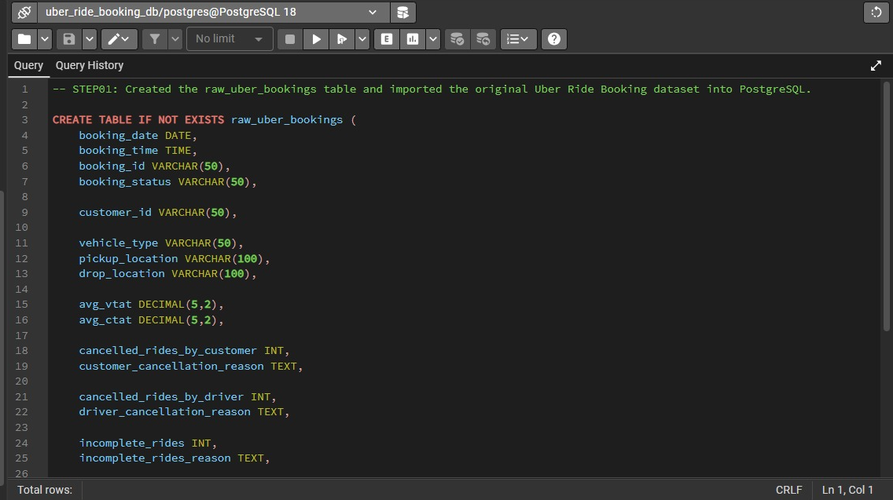


---


## 📈 Data Inspection

The raw dataset was inspected to understand its structure and assess data quality before cleaning and transformation.

- **Dataset Structure:** Confirmed 150,000 records across 21 columns and verified column data types.

- **Categorical Values:** Found 5 booking statuses, 176 pickup/drop-off locations, 7 vehicle types, 5 customer cancellation reasons, 4 driver cancellation reasons, and 3 incomplete ride reasons.

- **Geographic Coverage:** Identified Delhi–NCR as the primary region, covering Delhi, Gurugram, Noida, Ghaziabad, Faridabad, Greater Noida, and nearby cities, confirming regional rather than nationwide coverage.

- **NULL Values:** Found NULLs mainly in ride metrics, cancellation fields, ratings, booking value, ride distance, and payment method. Their patterns matched booking_status, confirming they are genuine outcome-based NULLs and should not be imputed.

- **Blank & Whitespace Check:** Used TRIM() on relevant text fields; found no blank values or unwanted spaces, so no text cleaning was required.

- **Booking ID Uniqueness:** Found 148,767 distinct booking IDs with 1,233 repeated records. Repeated IDs represent separate rides, so booking_id was retained as a non-unique business identifier.

- **Customer ID Distribution:** Found 148,788 distinct customer IDs with 1,212 repeated records. Repeated IDs represent customers making multiple bookings, not duplicate rides.

- **Binary Ride Indicators:** incomplete_rides, cancelled_rides_by_customer, and cancelled_rides_by_driver contained only 1 and NULL. NULL indicated the event did not occur, so these were converted to 0 during cleaning.

- **Negative Value Check:** Found no negative values in ride metrics, booking value, ride distance, or ratings, so no correction was required.

- **Outlier Check:** IQR analysis found no outliers in avg_vtat, avg_ctat, or ride_distance. Outliers in booking_value (3,435), driver_rating (5,203), and customer_rating (3,257) were retained because the ratings were within the valid 3–5 range and no reliable business rule justified removing the booking-value outliers.


---

## 📈 Data Cleaning

- **Created Clean Table:** Created clean_uber_bookings as a duplicate of raw_uber_bookings to preserve the original dataset. All further             cleaning, transformations, and analysis will be performed using the clean table, while keeping the raw data unchanged for reference.

- **NULL Handling:** Replaced NULL with 0 in cancelled_rides_by_customer, cancelled_rides_by_driver, and incomplete_rides because NULL indicated     the event did not occur.

- **Column Renaming:** Renamed Cancelled Rides by Customer, Cancelled Rides by Driver, Incomplete Rides, and Incomplete Rides Reason to singular,    consistent names because each row represents one ride record.

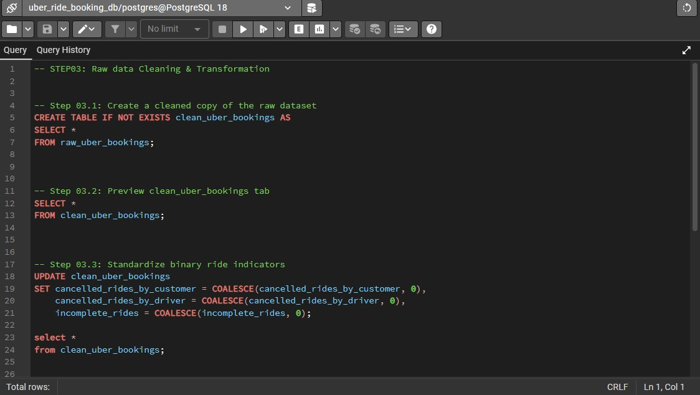

---

## 📈 Database Normalization

**Why Normalization?**

The raw dataset contained **150,000 ride records in one wide table**, with repeated customer, vehicle, location, and ride-reason information. Normalization reduces data redundancy, improves consistency, and establishes clear relationships between related data.


### 1. Database Normalization

🔷 **The cleaned data was normalized into 5 tables with 30 columns:**

| Table               | Columns | Purpose                                       |
| ------------------- | ------: | --------------------------------------------- |
| `dim_customer`      |       1 | Stores unique customer IDs                    |
| `dim_vehicle`       |       2 | Stores vehicle IDs and vehicle types          |
| `dim_location`      |       2 | Stores unique locations                       |
| `dim_ride_reason`   |       3 | Stores cancellation & incomplete ride reasons |
| `fact_ride_booking` |      22 | Stores individual ride records and metrics    |

🔷 **Why these tables?**

* **Customer:** Avoids repeating customer information across rides.
* **Vehicle:** Separates reusable vehicle information from ride records.
* **Location:** Stores each location once and reuses its ID for pickup/drop-off.
* **Ride Reason:** Centralizes different cancellation and incomplete-ride reasons.
* **Fact:** Keeps ride-level data and connects it to the dimensions.

🔷 **Key Design Decision:**
A new `ride_id` was generated as the **Primary Key** because `booking_id` was not unique.


🔷 **View Normalized Dataset Files:** [uber-ride-booking-normalized-dataset-files](https://www.kaggle.com/datasets/ektasinghchauhan/uber-ride-bookings-normalized-dataset?select=fact_ride_booking.csv)


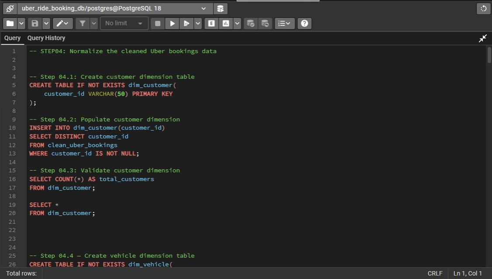


### 2. ER Diagram

The ER diagram shows how the fact and dimension tables are connected through **Primary Keys (PK)** and **Foreign Keys (FK)**. PostgreSQL foreign keys maintain referential integrity between related tables.


### 3. Normalized Tables

#### 🔷 `dim_customer`

| Column        | Data Type   | Constraint |
| ------------- | ----------- | ---------- |
| `customer_id` | VARCHAR(50) | **PK**     |


---

#### 🔷 `dim_vehicle`

| Column         | Data Type   | Constraint           |
| -------------- | ----------- | -------------------- |
| `vehicle_id`   | VARCHAR(10) | **PK**               |
| `vehicle_type` | VARCHAR(50) | **UNIQUE, NOT NULL** |


---

#### 🔷 `dim_location`

| Column          | Data Type    | Constraint           |
| --------------- | ------------ | -------------------- |
| `location_id`   | VARCHAR(10)  | **PK**               |
| `location_name` | VARCHAR(100) | **UNIQUE, NOT NULL** |

---

#### 🔷 `dim_ride_reason`

| Column        | Data Type    | Constraint   |
| ------------- | ------------ | ------------ |
| `reason_id`   | VARCHAR(10)  | **PK**       |
| `reason_type` | VARCHAR(30)  | **NOT NULL** |
| `reason`      | VARCHAR(100) | **NOT NULL** |

---

#### 🔷 `fact_ride_booking`

| Column                       | Data Type   | Constraint |
| ---------------------------- | ----------- | ---------- |
| `ride_id`                    | BIGSERIAL   | **PK**     |
| `booking_id`                 | VARCHAR(50) | —          |
| `booking_date`               | DATE        | —          |
| `booking_time`               | TIME        | —          |
| `booking_status`             | VARCHAR(30) | —          |
| `customer_id`                | VARCHAR(50) | **FK**     |
| `vehicle_id`                 | VARCHAR(10) | **FK**     |
| `pickup_location_id`         | VARCHAR(10) | **FK**     |
| `drop_location_id`           | VARCHAR(10) | **FK**     |
| `avg_vtat`                   | NUMERIC     | —          |
| `avg_ctat`                   | NUMERIC     | —          |
| `cancelled_ride_by_customer` | INTEGER     | —          |
| `customer_reason_id`         | VARCHAR(10) | **FK**     |
| `cancelled_ride_by_driver`   | INTEGER     | —          |
| `driver_reason_id`           | VARCHAR(10) | **FK**     |
| `incomplete_ride`            | INTEGER     | —          |
| `incomplete_reason_id`       | VARCHAR(10) | **FK**     |
| `booking_value`              | NUMERIC     | —          |
| `ride_distance`              | NUMERIC     | —          |
| `driver_rating`              | NUMERIC     | —          |
| `customer_rating`            | NUMERIC     | —          |
| `payment_method`             | VARCHAR(50) | —          |


**Validation:** Confirmed **150,000 ride records**, **150,000 unique `ride_id`s**, and **0 missing mandatory dimension mappings** before applying the FK constraints.

---

## 📈 SQL Business Analysis

- After normalization, SQL was used to analyze the data from a business perspective. The analysis was organized into the following areas:

  - **Overall Booking Performance:** Bookings, ride outcomes, revenue, distance, VTAT & CTAT.
  - **Customer Analysis:** Customer activity, repeat usage, booking value & cancellations.
  - **Vehicle Performance:** Bookings, ride outcomes, revenue & distance by vehicle.
  - **Cancellation Analysis:** Customer/driver cancellations, reasons & patterns.
  - **Location & Route Analysis:** Top locations, routes, bookings, revenue & failed rides.
  - **Incomplete Ride Analysis:** Incomplete ride reasons, vehicles & locations.
  - **Rating & Service Quality:** Customer/driver ratings and vehicle-level ratings.
  - **Payment Analysis:** Payment method distribution and completed-ride preferences.

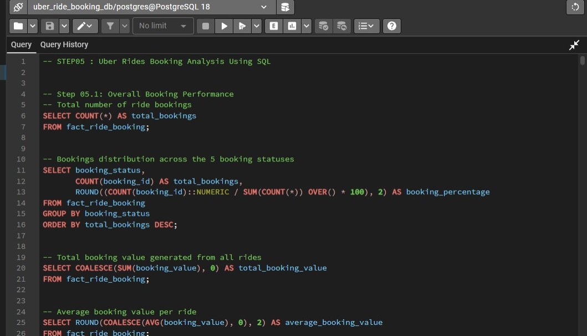

<hr>

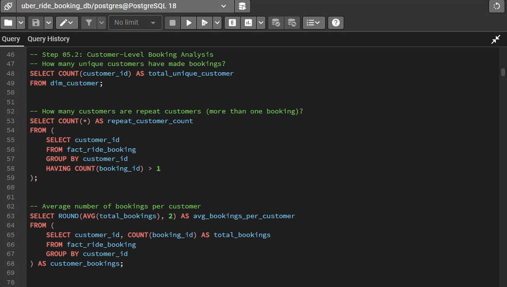

<hr>

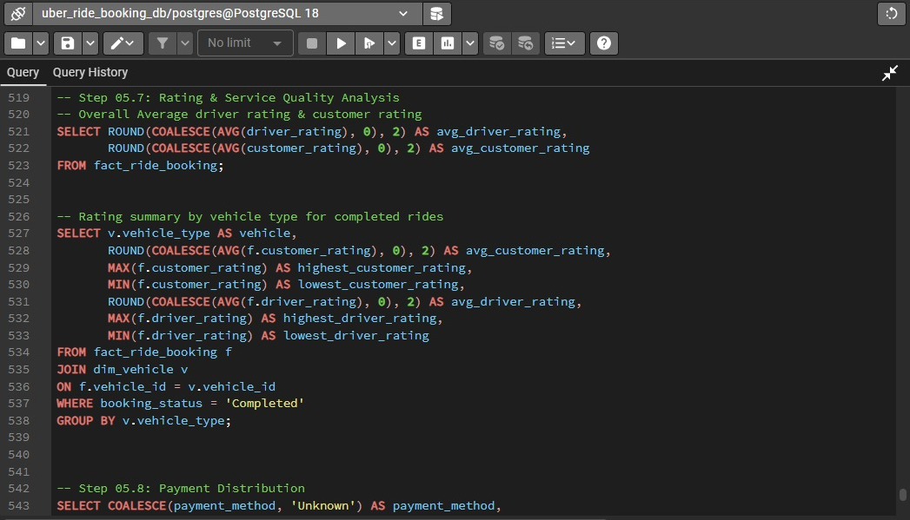

---

## 📈 Power BI Dashboard

- The normalized PostgreSQL database was connected to Power BI to build an interactive dashboard. The final dashboard contains 5 pages.

### 🔷 Overview

- Provides a high-level view of bookings, ride outcomes, revenue, fares, and vehicle performance.


<hr>

### 🔷 Customer Analysis

- Analyzes customer behavior, repeat usage, spending, ratings, payment preferences, and ride outcomes.

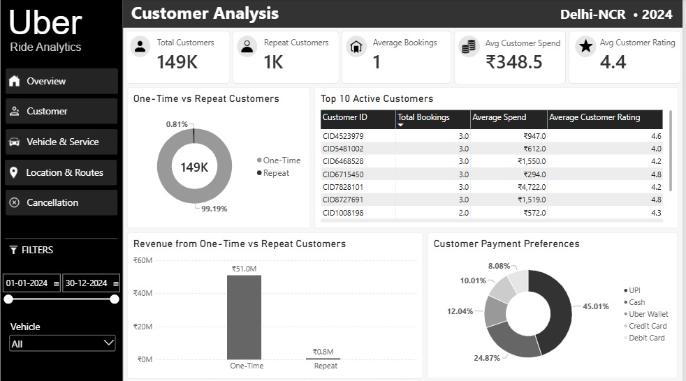

<hr>

### 🔷 Vehicle & Service Performance

- Analyzes vehicle-wise ride outcomes, operational times, distance, and service performance.

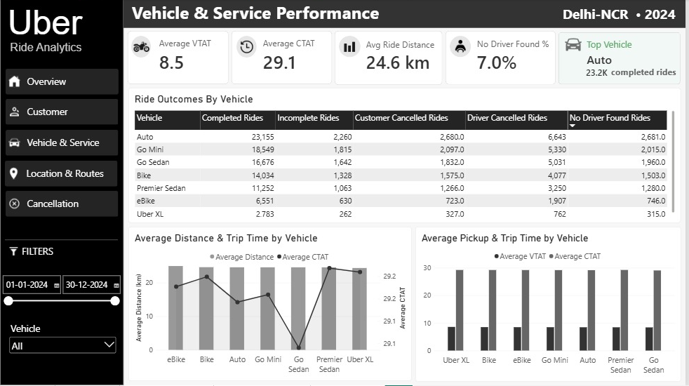

<hr>

### 🔷 Location & Route Analysis

- Analyzes booking demand across locations and routes, along with route bookings and revenue.

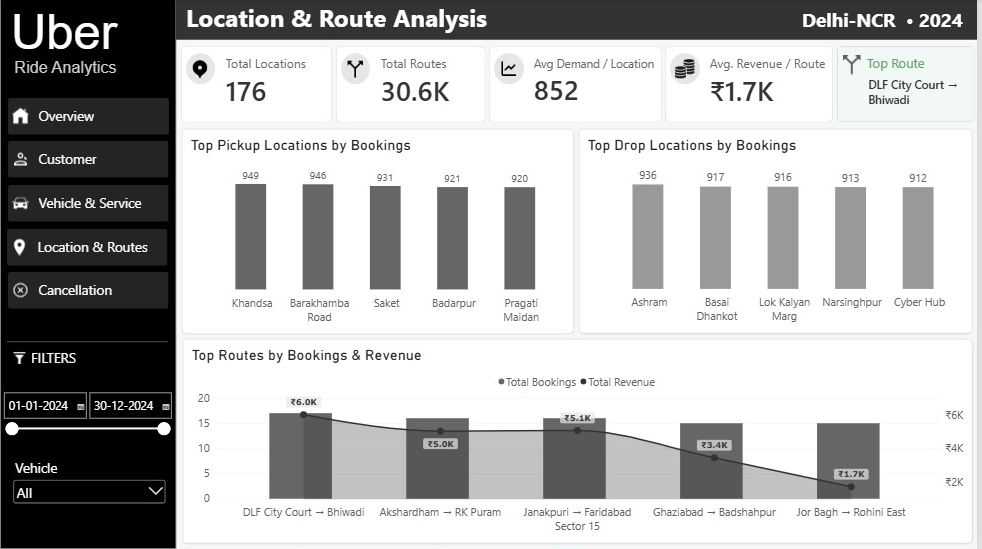

<hr>

### 🔷 Cancellation & Incomplete Analysis

- Analyzes cancellation and incomplete ride reasons, failed rides, and locations with high failed-ride activity.

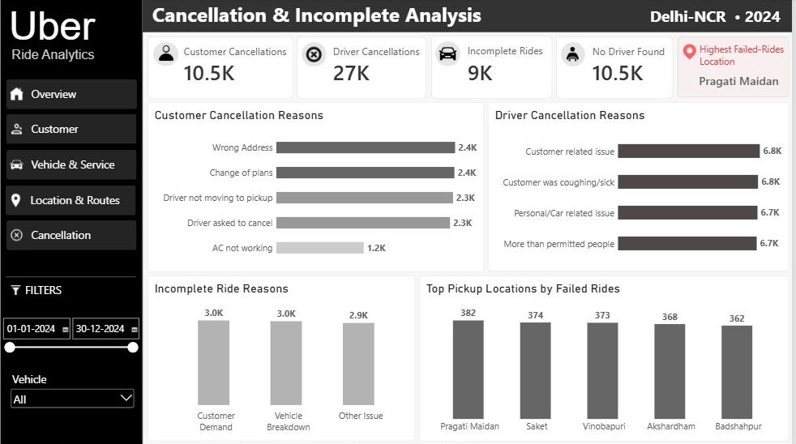

---


## 📈 Key Business Findings

### 🔷 Overview

- 150K bookings generated approximately ₹51.8M revenue, with 93K completed rides (62%).
- 38K rides were cancelled (25%), while 6% were incomplete and 7% had no driver found.
- Monthly demand remained relatively stable, ranging from approximately 11.8K to 12.9K bookings.
- Auto recorded the highest booking volume at approximately 37K bookings, while average ride fare was ₹508.3.


### 🔷 Customer Analysis

- The customer base was overwhelmingly one-time customers (99.19%), with repeat customers accounting for only 0.81%.
- One-time customers generated approximately ₹51.0M, compared with only ₹0.8M from repeat customers.
- UPI was the most-used payment method (45.01%), followed by Cash at 24.87%.
- The average customer rating was 4.4, while the average spend per customer was ₹348.5.

### 🔷 Vehicle & Service Performance

- Auto had the highest completed rides with approximately 23.2K, followed by Go Mini (18.5K) and Go Sedan (16.7K).
- Driver cancellations were substantially higher than customer cancellations, with approximately 27K driver cancellations across the dataset.
- Auto alone recorded 6,643 driver-cancelled rides, around 25% of all driver cancellations.
- Average VTAT was 8.5, while average CTAT was 29.1, with an average ride distance of 24.6 km.

### 🔷 Location & Route Analysis

- The dataset covered 176 locations and approximately 30.6K unique routes, with average demand of 852 bookings per pickup location.
- The busiest pickup locations had around 920–949 bookings, showing relatively similar demand among the top locations.
- DLF City Court → Bhiwadi was the top route with 17 bookings and ₹6.0K revenue.
- Routes with similar booking volumes generated noticeably different revenue; for example, DLF City Court → Bhiwadi generated ₹6.0K, compared with   ₹1.7K for Jor Bagh → Rohini East.

### 🔷 Cancellation & Incomplete Analysis

- Driver cancellations (≈27K) were about 2.6× higher than customer cancellations (≈10.5K).
- The largest customer cancellation reasons were Wrong Address and Change of Plans, at approximately 2.4K rides each.
- Driver cancellation reasons were much larger individually, with the top reasons accounting for approximately 6.7–6.8K rides each.
- Pragati Maidan had the highest failed-ride activity with 382 failed rides, followed by Saket (374) and Vinobapuri (373).

---

## 📈 Project Structure

```text
Uber_Ride_Booking_Analytics/
│
├── Dataset/
│   ├── Normalized Dataset/
│   │   ├── dim_customer.csv
│   │   ├── dim_location.csv
│   │   ├── dim_ride_reason.csv
│   │   ├── dim_vehicle.csv
│   │   └── fact_ride_booking.csv
│   │
│   └── Raw/
│       └── uber_ride_data.csv
│
├── Images/ 
│   ├── 15 images
│
├── SQL/
│   ├── 01_database_setup.sql
│   ├── 02_data_inspection.sql
│   ├── 03_data_cleaning.sql
│   ├── 04_normalization.sql
│   └── 05_uber_ride_booking_analysis.sql
│
├── PowerBI/
│   └── uber_ride_analytics.pbix
│
└── README.md
```

---

## 📈 Skills Demonstrated

- SQL & PostgreSQL
- Data Cleaning & Validation
- Database Normalization & ER Modeling
- Business & Exploratory Analysis
- DAX & Data Modeling
- Power BI Dashboard Development
- KPI & Metric Design
- Data Visualization & Storytelling
- Business Problem Solving


---

## Author

- Ekta Singh Chauhan

- Data Analytics | SQL | PostgreSQL | Power BI 

- This project was created as part of my data analytics portfolio to practice database design, SQL analysis, data modeling and dashboard             development.

---

## Dataset Disclaimer

- This dataset is intended for educational purposes, portfolio development, and business analytics learning. It should not be considered    official Uber operational data.

---
