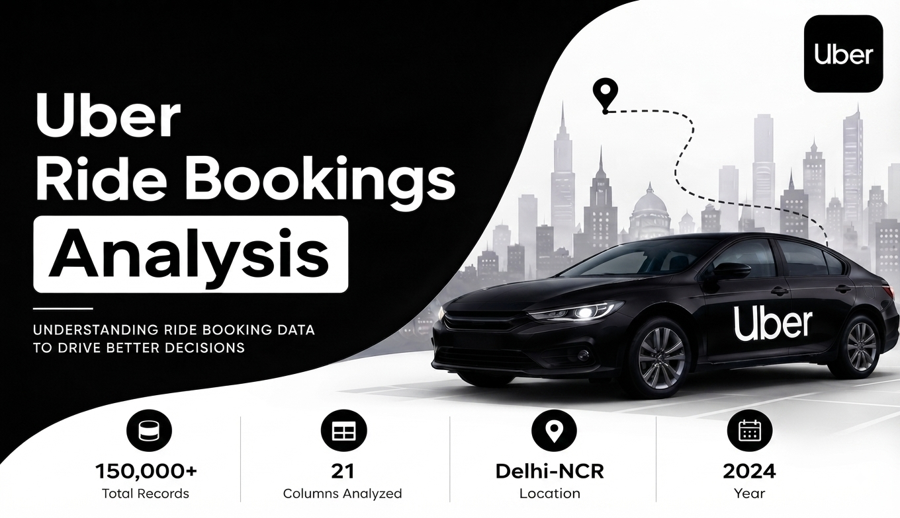
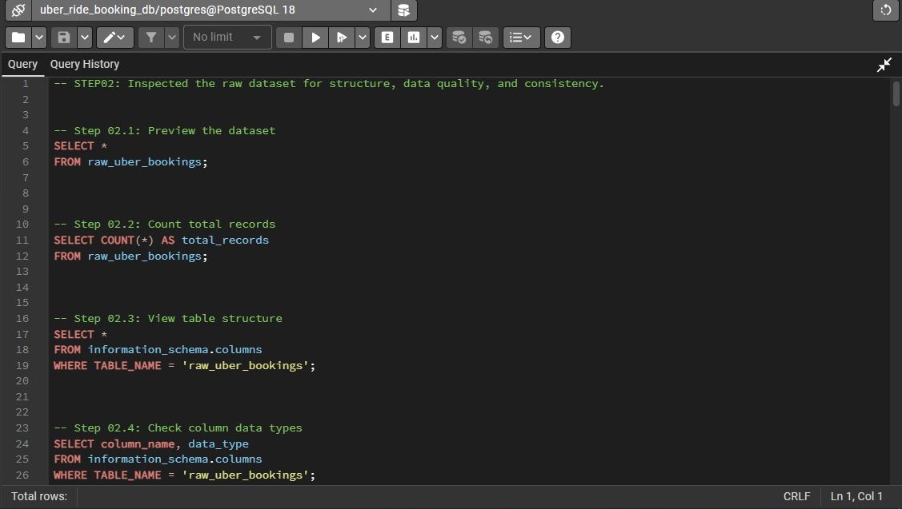
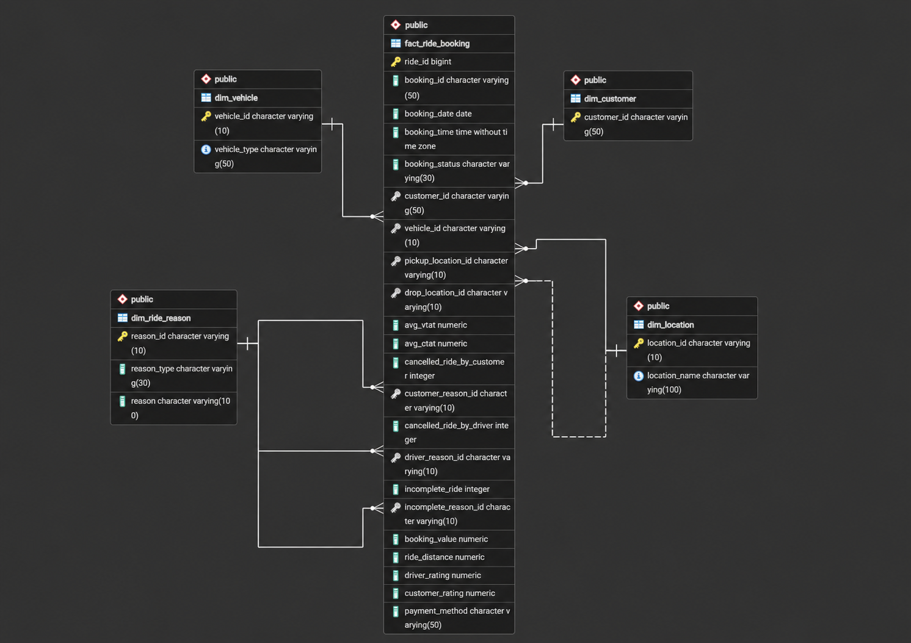

# 📊 Uber Ride Booking Analytics & Operations

> **Project Status: In Progress**
> 



---

## 📈 Project Overview

- This project analyzes Uber ride booking data to uncover actionable business insights related to customer behavior, driver                 performance, revenue, booking trends, cancellations, payment preferences, and operational efficiency.

- The project uses PostgreSQL for database design and SQL analysis, followed by Python and Streamlit for visualization and deployment.

---

## 📈 Objectives

- Analyze booking patterns by month, day, and hour.

- Evaluate driver and customer performance using ratings.

- Identify revenue patterns across vehicle types and locations.

- Analyze ride cancellations and their reasons.

- Examine payment method preferences.

- Measure operational efficiency using pickup and trip time metrics.

- Generate business insights using advanced SQL queries.

---

## 📈 Tech Stack

- **Database               :**  PostgreSQL
- **Query Language         :**  SQL
- **Programming Language   :**  Python
- **Libraries              :**  Pandas, SQLAlchemy, Plotly, Seaborn, Streamlit
- **IDE:** VS Code
- **Version Control        :**  Git & GitHub

---

## 📈 Dataset Overview

- This section provides an overview of the dataset, including its   source, structure, scope, and key features used for analysis

### 🔹 Dataset Information

- **Dataset:** Uber Ride Analytics Dataset (2024)
- **Source:** Kaggle
- **Total Records:** 150,000
- **Time Period:** 2024
- **Location:** Delhi NCR (National Capital Region), India
- **Granularity:** One row represents one ride booking.


### 🔹 Features Included

- Booking Details
- Customer Information
- Vehicle Information
- Ride Information
- Payment Information
- Ratings
- Cancellation Details
- Operational Metrics

### 🔹 Dataset Link: [uber-ride-booking-kaggle-dataset](https://www.kaggle.com/datasets/nidhisharma25/uber-ride-bookings-ncr-2024)

---

## 📈 Analytics Workflow

```text
Raw Dataset (CSV)
        ↓
PostgreSQL Database
        ↓
Raw Data Import
        ↓
Data Inspection (SQL)
        ↓
Data Cleaning (SQL)
        ↓
Database Normalization
        ↓
ER Diagram
        ↓
Normalized Tables
        ↓
Data Loading
        ↓
SQL Analysis
        ↓
Views & Indexes
        ↓
Python + SQLAlchemy
        ↓
Streamlit Dashboard
        ↓
Project Deployment
```

---


## 📈 PostgreSQL Database Setup

- Created a PostgreSQL database named **`uber_ride_booking_db`** to store and manage the Uber Ride Booking dataset for SQL-based data       analysis.

---

## 📈 Raw Data Import

- Imported the raw CSV dataset into the **`raw_uber_bookings`** table using pgAdmin's Import/Export tool. The table contains all            original dataset features without modification. 

- During import, `"null"` string values were mapped to SQL `NULL` values to ensure proper data type handling and prevent import errors.


---


## 📈 Data Inspection

The raw dataset was inspected to understand its structure and assess overall data quality before performing any cleaning or               transformation.

- **Dataset Structure:** Confirmed 150,000 records across 21 columns and reviewed the table structure and data types to ensure the                                fields were stored appropriately.

- **Categorical Values:** Inspected unique values across key categorical fields, including 5 booking statuses, 176 pickup/drop-off locations, 7 vehicle types, 5 customer cancellation reasons, 4 driver cancellation reasons, and 3 incomplete ride reasons.

- **Geographic Coverage:** The locations show that the dataset primarily represents Delhi–NCR ride activity, covering Delhi, Gurugram,                               Noida, Ghaziabad, Faridabad, Greater Noida, and nearby areas such as Meerut, Sonipat, Panipat, Bhiwadi, and                               Bahadurgarh. This indicates that the dataset is regional rather than nationwide.

- **NULL Values:** Checked all columns and found NULLs mainly in ride metrics, cancellation-related fields, ratings, booking value,                          ride distance, and payment method. These were further validated against booking_status. The NULL patterns                                 consistently matched the ride outcome—for example, cancelled rides naturally have no completed-ride metrics, while                        Completed rides contain the relevant ride values. Therefore, the NULLs are valid and will not be imputed.

- **Blank & Whitespace Check:** Checked relevant text columns for blank values and leading/trailing spaces using TRIM(). No blank values or unwanted spaces were found, so no text cleaning was required.

- **Booking ID Uniqueness:** Of 150,000 records, 148,767 booking IDs are distinct, with 1,233 records associated with repeated IDs.                                    Repeated IDs represent different ride records, so they will be retained and treated as non-unique                                         identifiers.

- **Customer ID Distribution:** Out of 150,000 records, 148,788 customer IDs were distinct, resulting in 1,212 additional records from                                    repeated customer IDs. Investigation confirmed that these represent customers making multiple bookings,                                   which is expected and does not indicate duplicate records.

- **Binary Ride Indicators:** Inspected incomplete_rides, cancelled_rides_by_customer, and cancelled_rides_by_driver. All three contain                                 only 1 and NULL — 1 indicates the event occurred, while NULL indicates it did not. During cleaning, NULLs                                 will be converted to 0, and these columns along with incomplete_rides_reason will be renamed to singular                                  form to match the dataset’s one-row-per-ride-record granularity.

- **Negative Value Check:** Checked numeric ride metrics, booking value, ride distance, and ratings for negative values. No invalid negative values were found.

- **Outlier Check:** IQR analysis found no outliers in avg_vtat, avg_ctat, or ride_distance. Statistical outliers were found in booking_value (3,435), driver_rating (5,203), and customer_rating (3,257). Both rating columns fall within the expected 3–5 rating scale, so these are valid values. booking_value outliers were reviewed, but without a reliable business rule, they were retained. No outliers were removed.





---

## 📈 Data Cleaning

- **Created Clean Table:** Created clean_uber_bookings as a duplicate of raw_uber_bookings to preserve the original dataset. All further                             cleaning, transformations, and analysis will be performed using the clean table, while keeping the raw data                               unchanged for reference.

- **NULL Handling:** Replaced NULL with 0 in cancelled_rides_by_customer, cancelled_rides_by_driver, and incomplete_rides because NULL indicated the event did not occur.

- **Column Renaming:** Renamed Cancelled Rides by Customer, Cancelled Rides by Driver, Incomplete Rides, and Incomplete Rides Reason to singular, consistent names because each row represents one ride record.

---

## 📈 Database Normalization

**Why Normalization?**

The raw dataset contained **150,000 ride records in one wide table**, with repeated customer, vehicle, location, and ride-reason information. Normalization reduces data redundancy, improves consistency, and establishes clear relationships between related data.

### 1. Database Normalization

🔷 **The cleaned data was normalized into **5 tables with 30 columns:**

| Table               | Columns | Purpose                                       |
| ------------------- | ------: | --------------------------------------------- |
| `dim_customer`      |       1 | Stores unique customer IDs                    |
| `dim_vehicle`       |       2 | Stores vehicle IDs and vehicle types          |
| `dim_location`      |       2 | Stores unique locations                       |
| `dim_ride_reason`   |       3 | Stores cancellation & incomplete ride reasons |
| `fact_ride_booking` |      22 | Stores individual ride records and metrics    |

🔷 **Why these tables?**

* **Customer:** Avoids repeating customer information across rides.
* **Vehicle:** Separates reusable vehicle information from ride records.
* **Location:** Stores each location once and reuses its ID for pickup/drop-off.
* **Ride Reason:** Centralizes different cancellation and incomplete-ride reasons.
* **Fact:** Keeps ride-level data and connects it to the dimensions.

🔷 **Key Design Decision:**
A new `ride_id` was generated as the **Primary Key** because `booking_id` was not unique.

🔷 **View Normalized Dataset Files:** [uber-ride-booking-normalized-dataset-files](https://www.kaggle.com/datasets/ektasinghchauhan/uber-ride-bookings-normalized-dataset?select=fact_ride_booking.csv)

### 2. ER Diagram

The ER diagram shows how the fact and dimension tables are connected through **Primary Keys (PK)** and **Foreign Keys (FK)**. PostgreSQL foreign keys maintain referential integrity between related tables.





### 3. Normalized Tables

#### 🔷 `dim_customer`

| Column        | Data Type   | Constraint |
| ------------- | ----------- | ---------- |
| `customer_id` | VARCHAR(50) | **PK**     |


---

#### 🔷 `dim_vehicle`

| Column         | Data Type   | Constraint           |
| -------------- | ----------- | -------------------- |
| `vehicle_id`   | VARCHAR(10) | **PK**               |
| `vehicle_type` | VARCHAR(50) | **UNIQUE, NOT NULL** |


---

#### 🔷 `dim_location`

| Column          | Data Type    | Constraint           |
| --------------- | ------------ | -------------------- |
| `location_id`   | VARCHAR(10)  | **PK**               |
| `location_name` | VARCHAR(100) | **UNIQUE, NOT NULL** |


#### 🔷 `dim_ride_reason`

| Column        | Data Type    | Constraint   |
| ------------- | ------------ | ------------ |
| `reason_id`   | VARCHAR(10)  | **PK**       |
| `reason_type` | VARCHAR(30)  | **NOT NULL** |
| `reason`      | VARCHAR(100) | **NOT NULL** |


#### 🔷 `fact_ride_booking`

| Column                       | Data Type   | Constraint |
| ---------------------------- | ----------- | ---------- |
| `ride_id`                    | BIGSERIAL   | **PK**     |
| `booking_id`                 | VARCHAR(50) | —          |
| `booking_date`               | DATE        | —          |
| `booking_time`               | TIME        | —          |
| `booking_status`             | VARCHAR(30) | —          |
| `customer_id`                | VARCHAR(50) | **FK**     |
| `vehicle_id`                 | VARCHAR(10) | **FK**     |
| `pickup_location_id`         | VARCHAR(10) | **FK**     |
| `drop_location_id`           | VARCHAR(10) | **FK**     |
| `avg_vtat`                   | NUMERIC     | —          |
| `avg_ctat`                   | NUMERIC     | —          |
| `cancelled_ride_by_customer` | INTEGER     | —          |
| `customer_reason_id`         | VARCHAR(10) | **FK**     |
| `cancelled_ride_by_driver`   | INTEGER     | —          |
| `driver_reason_id`           | VARCHAR(10) | **FK**     |
| `incomplete_ride`            | INTEGER     | —          |
| `incomplete_reason_id`       | VARCHAR(10) | **FK**     |
| `booking_value`              | NUMERIC     | —          |
| `ride_distance`              | NUMERIC     | —          |
| `driver_rating`              | NUMERIC     | —          |
| `customer_rating`            | NUMERIC     | —          |
| `payment_method`             | VARCHAR(50) | —          |


**Validation:** Confirmed **150,000 ride records**, **150,000 unique `ride_id`s**, and **0 missing mandatory dimension mappings** before applying the FK constraints.


## Dataset Disclaimer

- This dataset is intended for educational purposes, portfolio development, and business analytics learning. It should not be considered    official Uber operational data.

---
