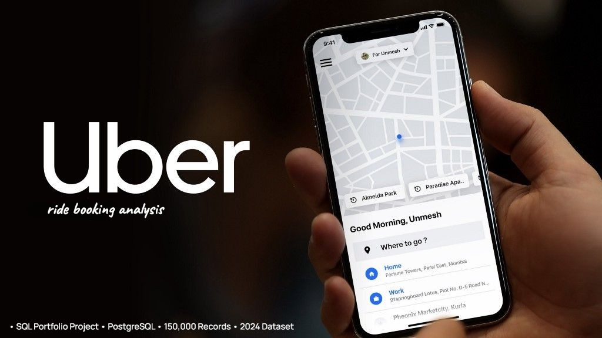

## 📊 Uber Ride Booking Analytics & Operations




---

## 📈 Project Overview

- This project analyzes Uber ride booking data to uncover actionable business insights related to customer behavior, driver                 performance, revenue, booking trends, cancellations, payment preferences, and operational efficiency.

- The project uses PostgreSQL for database design and SQL analysis, followed by Python and Streamlit for visualization and deployment.

---

## 📈 Objectives

- Analyze booking patterns by month, day, and hour.

- Evaluate driver and customer performance using ratings.

- Identify revenue patterns across vehicle types and locations.

- Analyze ride cancellations and their reasons.

- Examine payment method preferences.

- Measure operational efficiency using pickup and trip time metrics.

- Generate business insights using advanced SQL queries.

---

## 📈 Tech Stack

- **Database               :**  PostgreSQL
- **Query Language         :**  SQL
- **Programming Language   :**  Python
- **Libraries              :**  Pandas, SQLAlchemy, Plotly, Seaborn, Streamlit
- **IDE:** VS Code
- **Version Control        :**  Git & GitHub

---

## 📈 Dataset Overview

- This section provides an overview of the dataset, including its   source, structure, scope, and key features used for analysis

### 🔹 Dataset Information

- **Dataset:** Uber Ride Analytics Dataset (2024)
- **Source:** Kaggle
- **Total Records:** 150,000
- **Time Period:** 2024
- **Location:** Delhi NCR (National Capital Region), India
- **Granularity:** One row represents one ride booking.


### 🔹 Features Included

- Booking Details
- Customer Information
- Vehicle Information
- Ride Information
- Payment Information
- Ratings
- Cancellation Details
- Operational Metrics

### 🔹 Dataset Link: [Uber Ride Booking Dataset](https://github.com/Chauhanekta21/Uber_Ride_Booking_Analytics/tree/main/Dataset/Raw)

---

## 📈 Analytics Workflow

```text
Raw Dataset (CSV)
        ↓
PostgreSQL Database
        ↓
Raw Data Import
        ↓
Data Inspection (SQL)
        ↓
Data Cleaning (SQL)
        ↓
Database Normalization
        ↓
ER Diagram
        ↓
Normalized Tables
        ↓
Data Loading
        ↓
SQL Analysis
        ↓
Views & Indexes
        ↓
Python + SQLAlchemy
        ↓
Streamlit Dashboard
        ↓
Project Deployment
```

---


## 📈 PostgreSQL Database Setup

- Created a PostgreSQL database named **`uber_ride_booking_db`** to store and manage the Uber Ride Booking dataset for SQL-based data       analysis.

---

## 📈 Raw Data Import

- Imported the raw CSV dataset into the **`raw_uber_bookings`** table using pgAdmin's Import/Export tool. The table contains all            original dataset features without modification. 

- During import, `"null"` string values were mapped to SQL `NULL` values to ensure proper data type handling and prevent import errors.


---


## 📈 Data Inspection

The raw dataset was inspected to understand its structure and assess overall data quality before performing any cleaning or               transformation.

- **Dataset Structure:** Confirmed 150,000 records across 21 columns and reviewed the table structure and data types to ensure the                                fields were stored appropriately.

- **Categorical Values:** Inspected unique values across booking statuses, pickup/drop-off locations, and cancellation/incomplete ride                             reasons. The dataset contains 5 unique booking statuses and 176 unique pickup/drop-off locations, along with                              distinct reason categories for cancelled & incomplete rides.

- **Geographic Coverage:** The locations show that the dataset primarily represents Delhi–NCR ride activity, covering Delhi, Gurugram,                              Noida, Ghaziabad, Faridabad, Greater Noida, and nearby areas such as Meerut, Sonipat, Panipat, Bhiwadi, and                               Bahadurgarh. This indicates that the dataset is regional rather than nationwide.

- **NULL Values:** Checked all columns and found NULLs mainly in ride metrics, cancellation-related fields, ratings, booking value,                         ride distance, and payment method. These were further validated against booking_status. The NULL patterns                                 consistently matched the ride outcome—for example, cancelled rides naturally have no completed-ride metrics, while                        Completed rides contain the relevant ride values. Therefore, the NULLs are valid and will not be imputed.

- **Blank Values:** Checked relevant text columns for blank values using TRIM(). No blank values were found.

- **Booking ID Uniqueness:** Of 150,000 records, 148,767 booking IDs are distinct, with 1,233 records associated with repeated IDs.                                   Repeated IDs represent different ride records, so they will be retained and treated as non-unique                                         identifiers.

- **Customer ID Distribution:** Out of 150,000 records, 148,788 customer IDs were distinct, resulting in 1,212 additional records from                                   repeated customer IDs. Investigation confirmed that these represent customers making multiple bookings,                                   which is expected and does not indicate duplicate records.

- **Binary Ride Indicators:** Inspected incomplete_rides, cancelled_rides_by_customer, and cancelled_rides_by_driver. All three contain                                only 1 and NULL — 1 indicates the event occurred, while NULL indicates it did not. During cleaning, NULLs                                 will be converted to 0, and these columns along with incomplete_rides_reason will be renamed to singular                                  form to match the dataset’s one-row-per-ride-record granularity.

---

## 📈 Data Cleaning

- **Created Clean Table:** Created clean_uber_bookings as a duplicate of raw_uber_bookings to preserve the original dataset. All further cleaning, transformations, and analysis will be performed using the clean table, while keeping the raw data unchanged for reference.

---

## Dataset Disclaimer

- This dataset is intended for educational purposes, portfolio development, and business analytics learning. It should not be considered    official Uber operational data.

---
